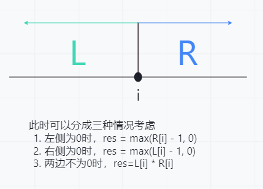

# 孤独的照片
题目链接：<https://www.acwing.com/problem/content/description/4264/>
算法标签：`枚举`、`乘法原理`
时间限制：1s
空间限制：64MB
## 题目大意
在一个由`G`和`H`组成的字符串中，取出所有长度大于等于3的子串，输出其中只包含一个`G`或`H`的子串的数量。
## 解题过程
### 思路一
解这类题目，最先想到的最简单的的方法就是暴力枚举，因此写了如下代码
```cpp
#include<bits/stdc++.h>
using namespace std;
int main() {
	int N, result = 0;
	string str;
	cin >> N >> str;
	int len = 3;
	while (true) {
		if (len > N) {
			break;
		}
		for (int i = 0; i <= N - len; i++) {
			int c1 = 0, c2 = 0;
			for (int j = i; j < i + len; j++) {
				if (str[j] == 'G') c1++;
				else c2++;
			}
			if (c1 == 1 || c2 == 1) result++;
		}
		len++;
	}
	cout << result;
}
```
通过遍历每一个长度的子串，找出符合条件的子串数量，但是这并不乐观。

题目时间限制为1s，5000的长度就g了，那么我们换一种思路。
## 思路二
我们想要知道包含孤独字符的子串有多少个，我们可以获取每一个字符左侧和右侧与其不同的连续字符的数量，例如`HHHGHHHH`，其中`G`的左侧有3个连续相反字符，右侧有4个连续相反字符。那我们就可以列出下表。
```
left:
H、HH、HHH、空
right:
H、HH、HHH、HHHH、空
```
此时就拥有4 * 5种组合，但是左右两侧为空又是一种特殊情况，因为题目要求子串长度需不小于3，当其中一方为空，另一方长度必须大于等于2才能满足条件，因此我们可以得到如下公式。
我们此时假设存在一个点i，左侧有L个字符，右侧有R个字符：

由于可能存在某个字符的左侧和右侧都没有相反连续字符，那么这时可能会得到负数的情况，像`HHH`，这种情况应该也不属于我们要找的子串，因此都作为0处理，使用max函数将负数归零。
<strong style="color:#00b050;">AC代码：</strong>
```cpp
#include<bits/stdc++.h>
using namespace std;
typedef long long ll;
const int MAXN = 5e5;

ll N, result = 0;
string str;
int l[MAXN], r[MAXN];
int main() {
	cin >> N >> str;
	for (int i = 0, g = 0, h = 0; i < N; i++) {
		if (str[i] == 'G') l[i] = h, h = 0, g++;
		else l[i] = g, g = 0, h++;
	}
	for (int i = N - 1, g = 0, h = 0; i >= 0; i--) {
		if (str[i] == 'G') r[i] = h, h = 0, g++;
		else r[i] = g, g = 0, h++;
	}
	for (int i = 0; i < N; i++) {
		result += (ll)l[i] * r[i] + max(l[i] - 1, 0) + max(r[i] - 1, 0);
	}
	cout << result;
}
```
## 疑点解决
我有一个思路是这样的，我先将字符串全部转换为数字形式，例如`GGHHGHG`-->`22111`，只保留相同连续字符的数量，由于题目只要求找到孤独的牛的照片，所以是`G`是`H`无所谓，所以我找数字为1的点，对左右两边的数量进行思路二相同的处理，于是出现了下面的<strong style="color:#ff0000;">错误代码</strong>。
```cpp
#include<bits/stdc++.h>
using namespace std;
int main() {
	int N, result = 0;
	string str;
	cin >> N >> str;
	vector<int>lens;
	int temp = 1;
	for (int i = 1; i < str.size(); i++) {
		if (str[i] != str[i - 1]) {
			lens.push_back(temp);
			temp = 1;
		}
		else temp++;
	}
	lens.push_back(temp);
	if (lens.size() == 1) {
		cout << 0;
		return 0;
	}
	for (int i = 0; i < lens.size(); i++) {
		if (lens[i] == 1) {
			if (i != 0 && i != lens.size() - 1) result += (lens[i - 1]) * (lens[i + 1]) + lens[i - 1] - 1 + lens[i + 1] - 1;
			else if (i == 0 && lens[i + 1] >= 2) result += lens[i + 1] - 1;
			else if (i == lens.size() - 1 && lens[i - 1] >= 2) result += lens[i - 1] - 1;
		}
	}
	cout << result;
}
```
我思考了好半天才发现了问题，是我思考的时候忽略了一点，那就是像`GGHH`这样的字串也是会出现孤独字串的，如`GGH`和`GHH`。