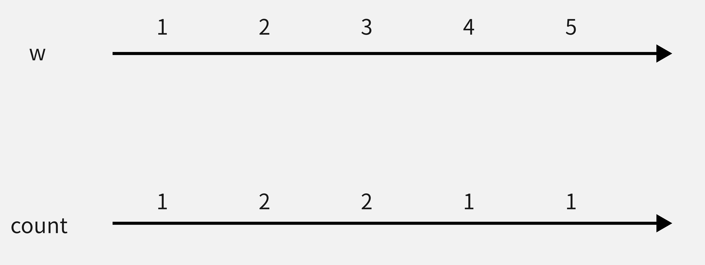
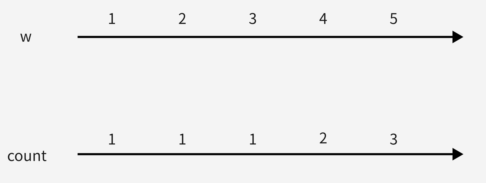

## 重新排序
题目链接：<https://www.acwing.com/problem/content/4658/>
算法标签：`差分`、`贪心`、`不等式排序`
时间限制：1s
空间限制：256MB
## 题目大意
给定一个数组 A 和一些查询 $L_i,R_i$，求数组中第 $L_i$ 至第 $R_i$ 个元素之和。
小蓝觉得这个问题很无聊，于是他想重新排列一下数组，使得最终每个查询结果的和尽可能地大。
小蓝想知道相比原数组，所有查询结果的总和最多可以增加多少?
## 解题过程
### 思路一
对于第一句话，我们直接使用前缀和就可以轻松解决了，可是可恶的小蓝不想让题目这么简单！！
我们知道，把大的数据放在查询次数多的地方，就能使最终的查询结果的总和更大，那么我们现在就需要得到每一个位置被查询多少次。
因此我们创建一个数组 count 用来记录每一个下标对应的查询次数，输入 l 和 r 表示查询下标从 l 到 r 的数据，那么 count 数组从下标 l 到下标 r 都要加一，但是使用for循环遍历效率很低，这里就用到了差分算法。
得到了每一个下标的查询次数，我们就可以计算结果总和了，便是如下公式：
$$
sum = c_1 * w_1 + c_2*w_2+...+c_n*w_n
$$
那么我们如何排序才能使这个结果最大呢？
这就用到了`排序不等式`，我们最后再说定理是如何证明的，现在我们可以直接使用这个定理。
1. 当两个数组都为完全升序/降序时，结果最大化。
2. 当数组一个为升序一个为降序时，结果最小化。

因此我们可以将两个数组都以升序排序，如下图所示：
**初始状态：**

**排序：**

**对排序结果归位：**

**由于题目只要求得到结果总和，并没规定输出排序好的序列，因此只需要做到第二步即可运算**

<strong style="color:#00b050;">AC代码：</strong>

```cpp
#include<bits/stdc++.h>
using namespace std;
const int MAXN = 1e5 + 10;
int w[MAXN], c[MAXN];
long long r1 = 0, r2 = 0;
int main() {
	int n; cin >> n;
	for (int i = 1; i <= n; i++) {
		cin >> w[i];
	}
	int m; cin >> m;
	while (m--) {
		int l, r;
		cin >> l >> r;
		c[l]++, c[r + 1]--;
	}
	for (int i = 1; i <= n; i++)c[i] += c[i - 1];
	for (int i = 1; i <= n; i++) {
		r1 += (long long)c[i] * w[i];
	}
	sort(c + 1, c + 1 + n);
	sort(w + 1, w + 1 + n);
	for (int i = 1; i <= n; i++) {
		r2 += (long long)c[i] * w[i];
	}
	cout << r2 - r1;
	return 0;
}
```