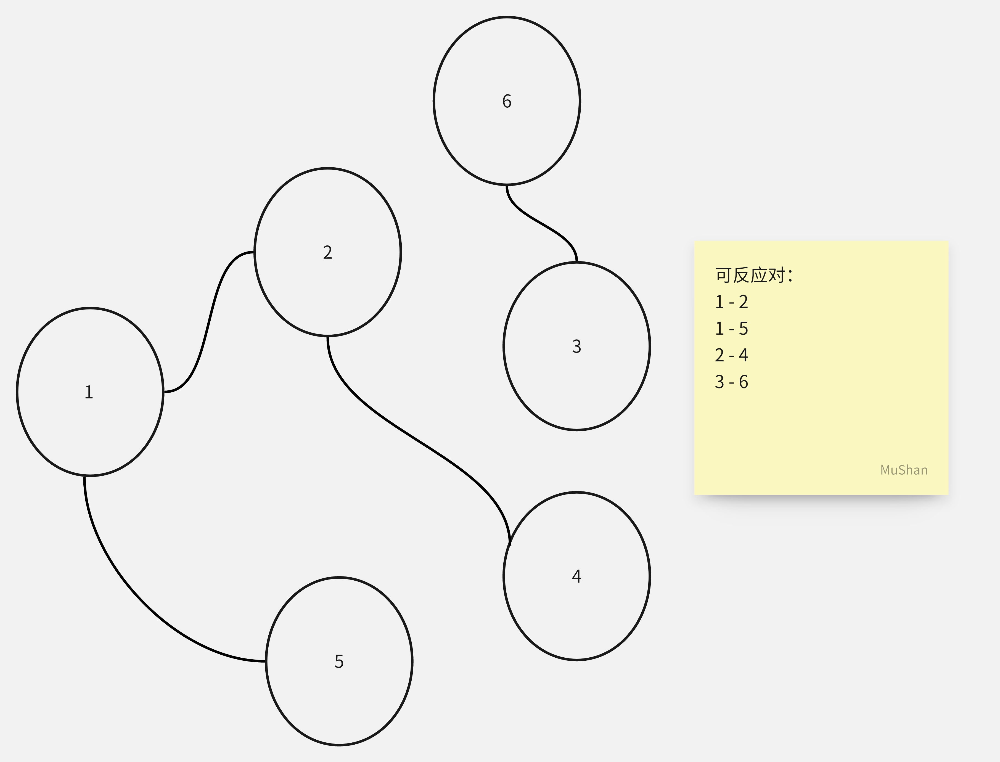
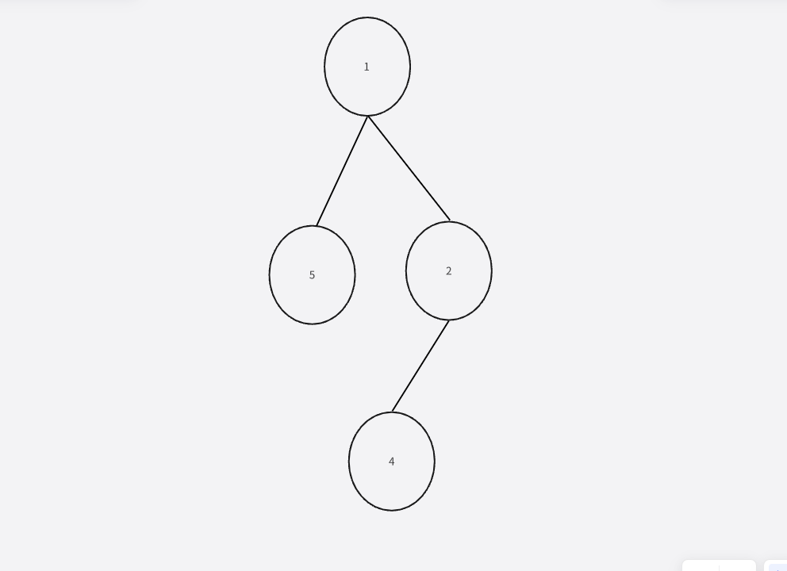

# 危险程度
题目链接：<https://www.acwing.com/problem/content/4796/>
算法标签：`贪心`、`并查集`
时间限制：1s
空间限制：256MB
## 题目大意
有一个试管和n个化学试剂，m对化学物质之间会发生反应，空试管的危险值为1，随后每加入一个化学试剂，如果该化学试剂可以和之前的任何一个试剂发生反应，则危险程度*2，求任何顺序加入试剂下最大危险程度为多少。
## 解题过程
### 思路一
首先我们可以把每一个化学试剂看做一个点，把每对可以反应的化学物质可以连成一个边

对于这个图，我们可以找到两个连通块，对于不同的连通块而言，无论之间是什么顺序进入试管，都不会对对方产生任何影响。那么我们便可以针对每一个**连通块**去思考，怎样的顺序可以使单个连通块内产生危险程度最大。
假设一个连通块有k个点，那么除了第一个不能发生反应，剩下的k-1都会发生反应能使危险程度最大，那么是否存在这样一个最大结果呢？
答案是可以，由于连通块保证了每一个点都能直接或间接的连接，那么它一定能够形成一个**树形结构**，而只需要按**层序遍历**的顺序依次加入，就可以达到最大值。

再想，既然每个连通块都能做到k-1次反应的最大值，危险程度为$2^{(k-1)}$，假设有p个连通块
$$2^{k_1-1}+2^{k_2-1}+...+2^{k_p-1}$$
发现，所有的k加在一起就是化学试剂的总数n，再减去连通块的数量p就是答案了。
因此其实我们并不需要知道顺序是什么，只需要求出连通块的数量就可以了，这里我们可以使用并查集来解答。
<strong style="color:#00b050;">AC代码：</strong>
```cpp
#include<bits/stdc++.h>
using namespace std;
const int MAXN = 55;
int fa[MAXN];
int find(int x) {
	while (x != fa[x]) x = fa[x] = fa[fa[x]];
	return x;
}
int main() {
	int n, m;
	int cnt = 0;
	cin >> n >> m;
	for (int i = 1; i <= n; i++) {
		fa[i] = i;
	}
	for (int i = 0; i < m; i++) {
		int x, y;
		cin >> x >> y;
		fa[find(x)] = fa[find(y)];
	}
	for (int i = 1; i <= n; i++) {
		if (fa[i] == i) cnt++;
	}
	cout << (1LL << (n - cnt));
}
```
本体主要考察的是贪心的思想（题目中出现类似求最大或最小的时候都可以将大问题拆分成小问题，从各个方面思考，什么状态下会最大或最小，能否直接利用这一状态），是否能将数据转换图的形式从而发现连通块的关系，以及并查集的算法应用。